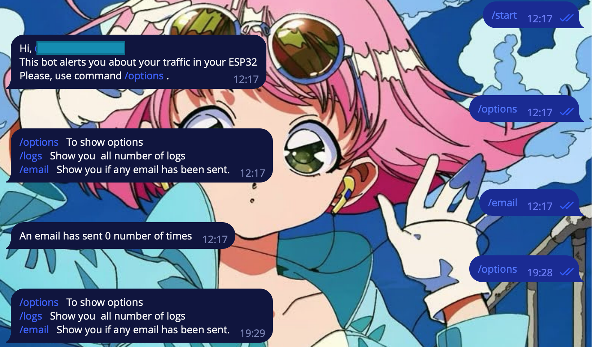
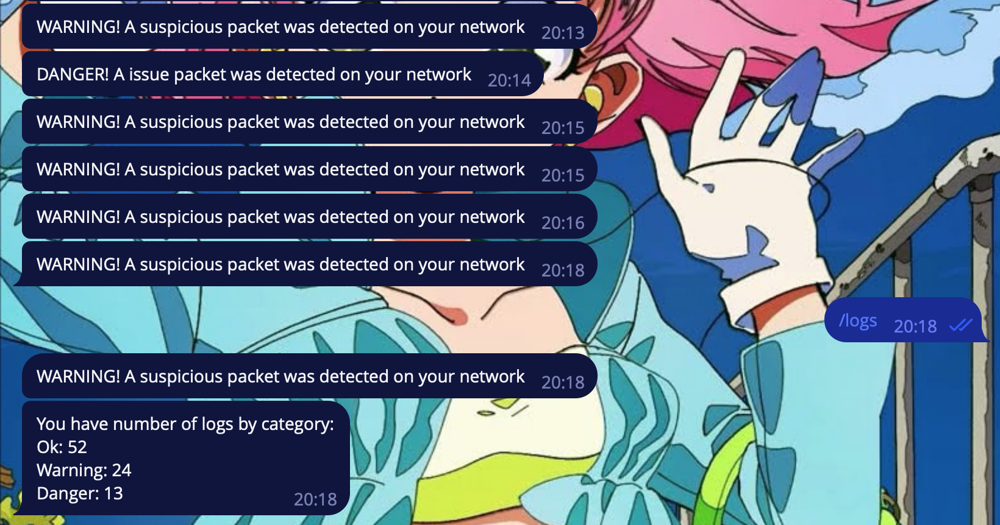

<p align="center"> 
 
</p>

# Intrusion detection system with ESP32

## Index

1. [What's an ESP32?](#whats-an-esp32)
2. [IDS](#ids-intrusion-detection-systems)
3. [Wireshark](#wireshark)
4. [Wireshark and ESP32](#wireshark-and-esp32)
5. [How we built it?](#how-we-built-it)

## What's an ESP32?

The Esp32 is a feature-rich MCU with integrated Wi-Fi and Bluetooth connectivity for a wide range of applications:

1. [Robust desing](#Robust-desing)

ESP32 is able to operate reliably in industrial environments, with operating temperatures ranging from -40 °C to +125 °C. Powered by advanced calibration circuitry, ESP32 can dynamically eliminate external circuit imperfections and adapt to changes in external conditions.

2. [Ultra low power consumption](#Ultra-low-powe-consumptiom)

Designed for mobile devices, wearable electronics and IoT applications, ESP32 achieves ultra-low power consumption with a combination of several types of proprietary software. ESP32 also includes state-of-the-art features such as fine-grained clock synchronization, multiple power modes and dynamic power scaling.

3. [High level of integration](#High-level-of-integration)

ESP32 is highly integrated with built-in antenna switches, RF balun, power amplifier, low noise receive amplifier, filters and power management modules. ESP32 adds invaluable functionality and versatility to your applications with minimal printed circuit board (PCB) requirements.

4. [Hybrid WiFi and Bluetooth chip](#Hybrid-WiFi-and-Bluetooth-chip)

ESP32 can operate as a complete stand-alone system or as a slave device to a host MCU, reducing the communications stack overhead on the main application processor. ESP32 can interface with other systems to provide Wi-Fi and Bluetooth functionality through its SPI/SDIO or I2C/UART interfaces.


## IDS (Intrusion Detection Systems)

Technological advances in the digital age have led to an exponential increase in the amount of information and data stored online. As organizations and individuals increasingly rely on the connectivity and accessibility of their systems, the threat of malicious intrusions and cyber attacks also increases. In this context, Intrusion Detection Systems (IDS) emerge as crucial elements in IT security defense.

An IDS is a tool designed to monitor and analyze network traffic for suspicious activity or anomalous behavior that may indicate an intrusion attempt or security breach. Its importance lies in several fundamental aspects that contribute to the integrity, confidentiality and availability of information systems.

First, IDSs play a key role in early identification of potential threats. By analyzing traffic patterns and anomalous behavior, these systems can detect intrusions in their early stages, enabling a fast and efficient response to mitigate risks before they cause significant damage.  This is crucial in a digital environment where speed of detection and response is essential to minimize the impact of attacks.


## Wireshark

Wireshark is a network packet analysis tool that deploys a variety of applications in the communications field. Its usefulness ranges from troubleshooting communications networks, performing security audits, to software and protocol development, in addition to its role as an educational resource. This analyzer, which incorporates all the standard features of a protocol analyzer, is used in a comprehensive and focused way to capture information passing through a connection.

## Wireshark and ESP32

Wireshark and ESP32 are two distinct technologies that can be integrated to enhance network monitoring and debugging capabilities in IoT (Internet of Things) applications. Wireshark is a network protocol analyzer, while ESP32 is a versatile microcontroller commonly used in IoT projects. The integration of these technologies allows for detailed analysis and troubleshooting of network communication in ESP32-based IoT devices. By leveraging Wireshark's packet capturing and analysis capabilities, developers can monitor and inspect the network traffic generated by ESP32 devices. This integration is particularly valuable during the development and debugging phases, as it provides insights into how the ESP32 communicates over the network, helping identify issues such as packet loss, latency, or unexpected behavior.

## How we built it?
This project simulates a IDS using a ```.cap``` file from Wireshark, and then using this file Python translates the information of this file and sends to ESP32. Besides, the database is simple since you will need created from MySQL and scheme , the name database name's **ids** and the table is **traffic** and the parameters of this table are **time (double), ipsrc(varchar(250)), ipdst(varchar(250)), protocol(varchar(250)), packlen(integer), info(varchar(1000))**, and then the second table is **administrator**, the parameter are **user(varchar(250))**,**password(varchar(250))** (if you want to encript you must add some extra parameters to PHP), **email(varchar(500))**. All data that was captured by Wireshark PHP and JavaScript create a table and then show as a Graph (Packets vs Time on miliseconds) and IP source. Finally, using ESP32 connected to computer and the hardware, Python sends a sign to ESP32. This sign turns on a Led if:
    
- Green: The size of packets is normal
- Yellow: The size of packets is little high
- Red: The size of packets is high

In other hand, this project implements services of SMTP (Simple Mail Transfer Protocol) **ONLY FOR GMAIL**, and Telegram. 
- If the traffic is normal, only turns up green led
- If the traffic is little high, Telegram Bot sends a warning messange.
- If the traffic is high, You'll receive a email and a message from Telegram Bot.

Talking about Telegram Bot, we create ones, you can see in this [link](https://t.me/Esp32ScanNetworkbot). However, we suggest that you create your own Telegram Bot since you'll need a Token. If you do not know how to create a Telegram Bot, please see this [article](https://core.telegram.org/bots). 



> Telegram Bot with options. 


> Logs using ESP32 and Telegram.

In other hand, for Gmail acount you most enable your **2-Step verification**, if you do not know how to do it, please check the official documentation of Google in this [link](https://support.google.com/accounts/answer/185839?hl=en&co=GENIE.Platform%3DAndroid). Once established your 2-Step verification then, create a [app password](https://support.google.com/mail/answer/185833?hl=en).

>[!NOTE]
>Make sure that your conection with your ESP32 works. The communication between ESP32 and Python is slow.

>[!NOTE]
>Use a VPN if your server is remote, however, if it's localhost, you'll need to comment lines 13 and 17 of file ```~/src/updatedbs.sh```

>[!Warning]
> Password of your table must be secure, we use password **root** for this example. Please change your database on 