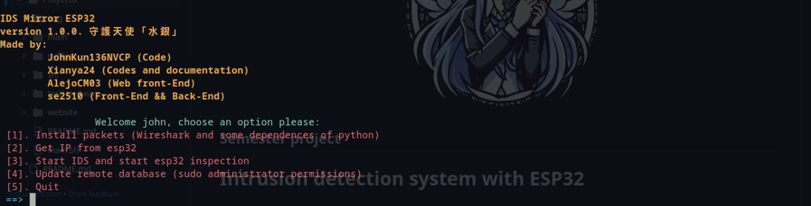

<p align="center"> 
 
</p>

# Intrusion detection system with ESP32

## Index

1. [What's an ESP32?](#whats-an-esp32)
2. [IDS](#ids-intrusion-detection-systems)
3. [Wireshark](#wireshark)
4. [Wireshark and ESP32](#wireshark-and-esp32)
5. [Before Installing](#install-arduino-ide-and-componets-for-esp32)
6. [IDS Port Mirror (Description)](#ids-port-mirror-description)
7. [How it works?](#how-it-works)
8. [Sightling](#sightling)
9. [Acknowledgments](#acknowledgments)
10. [Bibliography](#bibliography)

## What's an ESP32?

The Esp32 is a feature-rich MCU with integrated Wi-Fi and Bluetooth connectivity for a wide range of applications:

1. [Robust desing](#Robust-desing)

ESP32 is able to operate reliably in industrial environments, with operating temperatures ranging from -40 °C to +125 °C. Powered by advanced calibration circuitry, ESP32 can dynamically eliminate external circuit imperfections and adapt to changes in external conditions.

2. [Ultra low power consumption](#Ultra-low-powe-consumptiom)

Designed for mobile devices, wearable electronics and IoT applications, ESP32 achieves ultra-low power consumption with a combination of several types of proprietary software. ESP32 also includes state-of-the-art features such as fine-grained clock synchronization, multiple power modes and dynamic power scaling.

3. [High level of integration](#High-level-of-integration)

ESP32 is highly integrated with built-in antenna switches, RF balun, power amplifier, low noise receive amplifier, filters and power management modules. ESP32 adds invaluable functionality and versatility to your applications with minimal printed circuit board (PCB) requirements.

4. [Hybrid WiFi and Bluetooth chip](#Hybrid-WiFi-and-Bluetooth-chip)

ESP32 can operate as a complete stand-alone system or as a slave device to a host MCU, reducing the communications stack overhead on the main application processor. ESP32 can interface with other systems to provide Wi-Fi and Bluetooth functionality through its SPI/SDIO or I2C/UART interfaces.


## IDS (Intrusion Detection Systems)

Technological advances in the digital age have led to an exponential increase in the amount of information and data stored online. As organizations and individuals increasingly rely on the connectivity and accessibility of their systems, the threat of malicious intrusions and cyber attacks also increases. In this context, Intrusion Detection Systems (IDS) emerge as crucial elements in IT security defense.

An IDS is a tool designed to monitor and analyze network traffic for suspicious activity or anomalous behavior that may indicate an intrusion attempt or security breach. Its importance lies in several fundamental aspects that contribute to the integrity, confidentiality and availability of information systems.

First, IDSs play a key role in early identification of potential threats. By analyzing traffic patterns and anomalous behavior, these systems can detect intrusions in their early stages, enabling a fast and efficient response to mitigate risks before they cause significant damage.  This is crucial in a digital environment where speed of detection and response is essential to minimize the impact of attacks.


## Wireshark

Wireshark is a network packet analysis tool that deploys a variety of applications in the communications field. Its usefulness ranges from troubleshooting communications networks, performing security audits, to software and protocol development, in addition to its role as an educational resource. This analyzer, which incorporates all the standard features of a protocol analyzer, is used in a comprehensive and focused way to capture information passing through a connection.

## Wireshark and ESP32

Wireshark and ESP32 are two distinct technologies that can be integrated to enhance network monitoring and debugging capabilities in IoT (Internet of Things) applications. Wireshark is a network protocol analyzer, while ESP32 is a versatile microcontroller commonly used in IoT projects. The integration of these technologies allows for detailed analysis and troubleshooting of network communication in ESP32-based IoT devices. By leveraging Wireshark's packet capturing and analysis capabilities, developers can monitor and inspect the network traffic generated by ESP32 devices. This integration is particularly valuable during the development and debugging phases, as it provides insights into how the ESP32 communicates over the network, helping identify issues such as packet loss, latency, or unexpected behavior.

# Before installing.
>[!WARNING]
>Only works on Linux based on Ubuntu, Fedora and ArchLinux.


## Install Arduino IDE and componets for ESP32
- You need to dowload Arduino IDE (version Legacy 1.8.x) on [official website](https://www.arduino.cc/en/software).
- Into directory *Arduino*.
    ```bash
    cd arduino-1.8.X/
    ```
- Then give permissions to execute:
    ```bash
    chmod +x *.sh
    ```
- Execute the file *arduino-linux-setup.sh* as root:
    ```bash
    sudo ./arduino-linux-setup.sh $USER
    ```
- Reboot your computer.
    ```bash
    reboot
    ```
- Finally, install Arduino IDE.
    ```bash
    sudo ./install.sh
    ```

    ### ESP32 board on Arduino IDE
    1. You will need to give permissions to port with the next command ```sudo chmod 666 /dev/ttyUSB0```.
    2. Install python *esptool*. 
        >[!WARNING]
        >PIP3 install not works for Ubuntu. You will need to use this command:

            ```bash
            sudo apt-get update
            sudo apt-get install esptool
            ```
    3. Conect your ESP32 board to the computer.
    4. Once connected ESP32 is plugged, then LED of ESP32 will turn on.  If the LED does not light up, it is possible that the cable or the USB port is damaged.
    5. You need to dowload ESP32 board. For this, it's necessary to go to *Tools > Board* and select the corresponding option. In this case *Heltec ESP32 Arduino > Wireless Stick Lite*.
    6. You will need to give permissions to ports and although in many cases the IDE itself determines the port used by the board, in other cases it is necessary to specify it. To do this, go to *Tools > Port*, then select the port corresponding to the board. In Linux it starts with tty and is usually followed by the words ACM or USB with an order number.
    7. All that remains is to load the implemented code to the ESP32. To check that the engraving process is correct, a good option is to use the Blink example, since it does not require any external component.Once the code is ready, it is necessary to click on the check button of the IDE to verify that there is no error in it. Then, by clicking on the load button, the code is written to the ESP32. Once the code is finished loading the LED on the board will start blinking.

### Hardware
- 3 LEDS (Red, Yellow and Green)
- 1 Buzzer
- Protoboard

Diagrams bellow for blink (Leds) and Buzzer


## Install components for Pyton Requirements

Check if you have installed pip
```python
python -m pip --version
```
To see if you have the *PIP package manager* installed.

Install *NumPy* with the command 
```python
python -m pip install numpy
```

Install *Pandas* with the command

```python
python -m pip install pandas
```

To add the *PySerial library*:
```python
python -m pip install pyserial
```

## Install Wireshark (Linux)

This program can run on distro based on Debian, Fedora and ArchLinux

Run first option and Wireshark's going to install it

```shell
chmod +x main.sh
```
```shell
./main
```
You will see below of tittle and picture the menu, select option 1




# IDS Port Mirror (Description)

Within the framework of this project, we have developed an Intrusion Detection System (IDS) in which the ESP32 microcontroller plays a central role. Within this architecture, we have implemented a configuration composed of three light emitting diodes (LEDs), each designed with specific functionalities. The first LED, green in color, indicates the absence of threats; the second, yellow in hue, warns of possible danger; and the last, red in color, acts as a danger alarm, simultaneously activating a buzzer for sound alerts. In parallel, when the functionality associated with the red LED is activated, it generates a notification sent to the user through the Telegram messaging platform, as well as an alert message sent to the email of the same user registered in the GMAIL account.

## How it works?

The project operates as follows: it uses the ```main.sh``` program. Its execution requires administrator privileges.

**NOTE**: ***Before to run*** ```main.sh```. Firstly, run ```arduino ~/main/main.ino```. Arduino opens program and upload to ESP32 board. 

```shell
./main
```


When you have Wireshark and Python dependences, then **select 2 option** to get ESP32's IP (*You have to plugged your esp32 to computer*) and show  a list your open ports to serial connection, select it (some cases you should push *boot* button) then you get your IP and it keep it into .txt file (It's hidden)


Once it get ESP32's IP. Run **option 3**. (If you know your ESP32 IP save it). It needs your path of your ESP32's IP, then  show your network interfaces, select your Wifi interface or Ethernet connection.


And Tshark starts and it opens a windows with Wireshark, stop when you have enought data, saved as captured packets and as a file *name.csv*.


Then you will need to keep your .csv and give the path. IDS will start and there are options:
 
 1. When packet is high, Red Led will turn on, it sends a message to [Telegram Bot (Esp32NetworkTool)](https://t.me/Esp32ScanNetworkbot), and finally it send you a Email.
 2.  When packet is medium, Yellow Led will turn on and program sends you a message to Telegram
 3. When packet is low, only Green Led turns on.


**SOME PACKETS ARE DELAYED**

Finally, run **option 3** it keep it into a data base (remote). It works with OPENVPN, however you can implement another VPN. If it's local, please [comment line 13 and 47 of file updatedbs.sh](src/updatedbs.sh) and **works with ssh** (Change port if it's necessary) and it read .csv and upload using Mysql with MariaDB.


**OPTIONAL**
If you have local database just add php front-end. In this case we usted a públic IP (however only works using VPN) that show you below


> Loggin using IP 132.248.X.X (Use a private IP or and VPN for security)

Into website appears this


And a graph with time vs size of packet


The program offers five options for package installation, specifically designed for distributions such as Ubuntu, Fedora and Arch Linux. For the purpose of obtaining the IP address of the ESP32 through the serial port, the program will allow the selection of the corresponding serial port. The third option is for starting the Intrusion Detection System (IDS). The user can choose to start the IDS with the default IP address configuration or add a specific path to it. This phase displays the available network interfaces and starts the traffic analysis, thus establishing the conditions for the creation of a secure and efficient environment.

# Sightling

**Credentials.py** 
You will need to create a special password to send emails for Google, this a [video of Youtube How to create it ](https://youtu.be/g_j6ILT-X0k?si=09G6JfNStqjGayNi) and the structure of file is:

*Credentials.py*

```python
AUTHOR_EMAIL = "youremail@gmail.com"
AUTHOR_PASS = "XXXX XXXX XXXX XXXX" #Without spaces
RECIPIENT_EMAIL = "anotheremail@domain.com" #If there are more one, you can use a list ["1@domain.com","2@domain.com"]
SMTPSERVER = "smtp.google.com"
```

**Credentials.h**
Telegram creates a unique token, only works if you have our token and librery is implemented on ESP32 and not Python (a suggestion is created on Python and run it). For C++, *Credentials.h* is a header using to Wifi SSID and Password with Telegram Token. The structure is:

```c
#define ssid_STA "WIFI"//SSID of your wifi network
#define password_STA "XXXXX"//Password of your wifi
#define BOT_TOKEN "YYYYY YYYYY YYYYY" //Token to create a new bot
```


## Acknowledgments

For their support in the realization of this project and the material used in the project we would like to thank
 - [PhD. Alejandro Pompa García](https://www.iim.unam.mx/opompa.html) (IT Security IIM UNAM)
 - P. E. Oscar Alejandro Luna (IT Security IIM UNAM)
 - [David Elias González García](https://github.com/se2510) (Full Stack Developer)
 - [Alejandro Cortes Mora](https//github.com/AlejoCM03) (Front-End developer)


## Bibliography

1. Ashoor, A. S., & Gore, S. (2011). Importance of intrusion detection system (IDS). International 

2. Journal of Scientific and Engineering Research, 2(1), 1-4.

3. ESP32 Wi-Fi & Bluetooth SOC | Espressif Systems. (s. f.). https://www.espressif.com/en/products/socs/esp32

4. Nonato, N. (2022). Data acquisition system for fine surface process monitoring (Doctoral dissertation).

5. Tarter, A. (2017). Importance of cyber security. Community Policing-A European Perspective: Strategies, Best Practices and Guidelines, 213-230.

6. UCM-Proyecto de Innovación Software Libre para Ciencias e Ingenierías. (s. f.). https://www.ucm.es/pimcd2014-free-software/wireshark

In charge of the project: Physics student and Computer Engineer [Juan Angeles Hernández](https://github/JohnKun136NVCP) and Biology student [Xianya Itzel Díaz de León Márquez](https://github.com/Xianya24), for the subject Internet of Things, taught by M. Eng. Valente Vázquez Velázquez.
